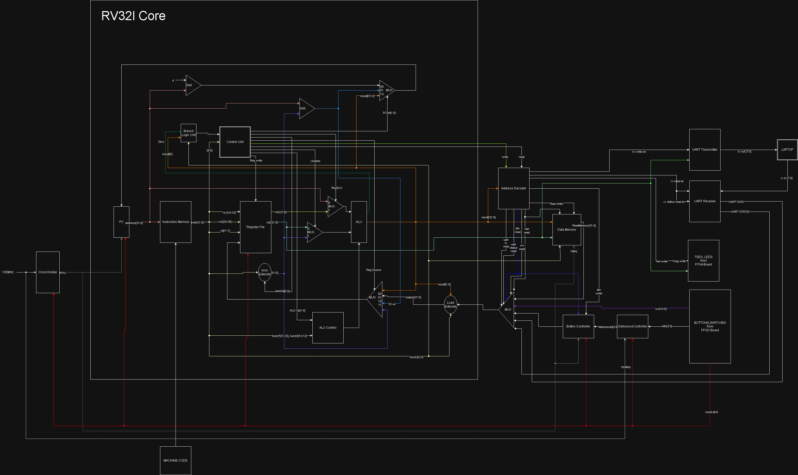

# HolySoC

HolySoC is a small FPGA system-on-chip built around a custom, single-cycle RISC-V RV32I processor. The design targets the Digilent Basys 3 board and connects the processor to instruction and data memory, switches, push buttons, LEDs, a four-digit seven-segment display, and a 115200-baud UART through memory-mapped I/O.



## Features

- Custom 32-bit RISC-V datapath with register file, ALU, immediate generation, branch logic, and load extension
- 1024-word instruction memory initialized from `instruction.mem`
- 1024-word data memory with byte, halfword, and word stores
- Memory-mapped switches, latched button events, LEDs, and seven-segment outputs
- UART transmit and receive at 115200 baud from the Basys 3 100 MHz clock
- Button synchronization and approximately 10 ms debounce filtering
- Example bare-metal C and generated RV32I assembly programs
- Verilog simulation testbenches for the ALU, instruction memory, processor core, and complete SoC

## Hardware Architecture

[`HolySoC.v`](sources_1/new/HolySoC.v) is the top-level module. It divides the board's 100 MHz clock to 1 MHz for the processor and data-path peripherals while the UART and button debouncers use the board clock directly.

The processor uses separate instruction and data memories. Data accesses below the MMIO region are routed to the internal RAM; peripheral accesses are selected by [`AddressDecoder.v`](sources_1/new/AddressDecoder.v).

### Memory Map

| Address | Access | Peripheral | Value |
|---|---|---|---|
| `0x00000000` and above | Read/write | Data RAM | 1024 x 32-bit words, indexed by address bits `[11:2]` |
| `0x10000000` | Read | Switches | Basys 3 switches in bits `[15:0]` |
| `0x10000004` | Write | LEDs | Basys 3 LEDs from bits `[15:0]` |
| `0x10000008` | Read/write | Buttons | Read latched rising-edge flags in bits `[3:0]`; any write clears them |
| `0x1000000C` | Write | Seven-segment segments | Segment outputs from bits `[6:0]` |
| `0x10000010` | Write | Seven-segment digits | Digit enables from bits `[3:0]` |
| `0x10000014` | Read | UART status | Bit 0: RX ready; bit 1: TX busy |
| `0x10000018` | Read/write | UART data | Read received byte or write transmit byte in bits `[7:0]` |

The seven-segment segment and digit outputs are active low on the Basys 3 board.

## Repository Layout

```text
.
|-- sources_1/new/   # Synthesizable Verilog and instruction memory image
|-- sim_1/new/       # Verilog simulation testbenches
|-- constrs_1/new/   # Basys 3 XDC pin and clock constraints
|-- game_1/          # Example bare-metal C, assembly, and machine-code files
|-- img/             # Architecture image
|-- LICENSE
`-- README.md
```

## Getting Started

### Prerequisites

- Digilent Basys 3 FPGA board
- AMD/Xilinx Vivado with support for the Artix-7 device on the Basys 3
- Optional: an RV32I-capable bare-metal GCC toolchain for rebuilding the example firmware
- Optional: a Verilog simulator for running the included testbenches

This repository does not include a Vivado `.xpr` project or build script. Create a Vivado RTL project and add the source sets below.

### Create the Vivado Project

1. Clone the repository:

   ```bash
   git clone https://github.com/ArmmyC/HolySoC.git
   cd HolySoC
   ```

2. Create a Vivado RTL project for the Basys 3 board, or select its `xc7a35tcpg236-1` device.
3. Add every `.v` file under `sources_1/new/` as design sources.
4. Add `sources_1/new/instruction.mem` as a memory initialization file.
5. Add every `.xdc` file under `constrs_1/new/` as constraints.
6. Set `HolySoC` as the synthesis top module.
7. Run synthesis, implementation, and bitstream generation, then program the board.

> [!IMPORTANT]
> [`InstructionMemory.v`](sources_1/new/InstructionMemory.v) currently passes an absolute local path to `$readmemh`. Change that string to `instruction.mem`, or to the path Vivado assigns to the memory file, before simulation or synthesis on another machine.

## Firmware

Instruction memory is loaded from [`sources_1/new/instruction.mem`](sources_1/new/instruction.mem). The file contains one 32-bit hexadecimal instruction per line and is addressed as 1024 words starting at address `0x00000000`.

The [`game_1`](game_1/) directory contains:

- `game_LED.c`: an LED timing game controlled by the switches and buttons
- `Test.c`: a basic LED and seven-segment output test
- Corresponding generated `.s` assembly and `.txt` machine-code files

To load another program, build it for `rv32i` with the ILP32 ABI and a bare-metal entry point at address zero, convert its executable code into the same one-word-per-line hexadecimal format, and replace `instruction.mem`. The repository does not currently include a linker script or firmware build automation, so the exact conversion command depends on the installed RISC-V toolchain.

The example programs show the MMIO interface directly:

```c
#define ADDR_SWITCHES ((volatile unsigned int *)0x10000000)
#define ADDR_LEDS     ((volatile unsigned int *)0x10000004)

unsigned int switches = *ADDR_SWITCHES;
*ADDR_LEDS = switches;
```

## Simulation

Testbenches are available in [`sim_1/new`](sim_1/new/):

| Testbench | Scope |
|---|---|
| `tb_ALU.v` | Steps through ALU control values |
| `tb_InstructionMemory.v` | Reads the first ten instruction words |
| `tb_RV32I_Core.v` | Clocks and resets the processor core |
| `tb_HolySoC.v` | Clocks and resets the top-level SoC |

Add the desired testbench as a Vivado simulation source and set it as the simulation top. These are waveform-oriented testbenches rather than self-checking tests. The core and SoC interfaces have evolved since some testbenches were written, so omitted ports may need to be connected before running them with strict simulators.

## License

HolySoC is available for non-commercial use under the terms in [LICENSE](LICENSE).
